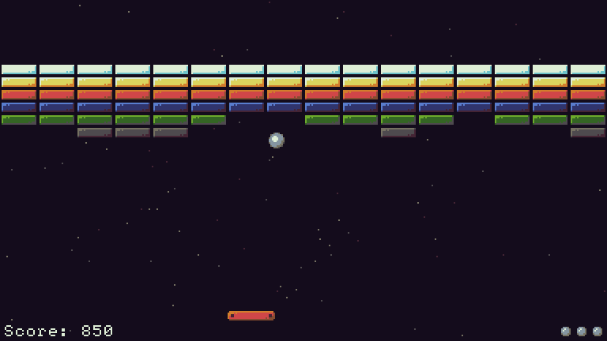

## Block-break

Block-break is a Breakout clone written in [MonoGame](https://www.monogame.net/), using the [PlayPlayMini framework](https://github.com/BenMakesGames/PlayPlayMini). It demonstrates:

* Multiple PlayPlayMini game states: a loading screen, title menu, settings menu, gameplay, pause menu, high-score entry, and a high-score table
* Sprite sheets, fonts, pictures, and sound effects
* SQLite & [EntityFramework 8](https://learn.microsoft.com/en-us/aspnet/entity-framework) for storing the high score table and settings
* [Serilog](https://serilog.net/) for logging errors to a text file

### A Caveat

This project was put together in only a couple evenings, and the game physics are pretty roughly-implemented (there are some known collision bugs, and the code itself is just pretty ugly).

The purpose of this project is to demonstrate the capabilities of PlayPlayMini - not to demonstrate good physics code - so I'm not too worried about it, BUT: if you'd like to make a pull request to improve this, or other aspects of the project, go for it! :)

## About the Author

My name is Ben, and I make games. You can find my stuff at:

* https://benmakesgames.com
* https://store.steampowered.com/search/?developer=Ben%20Hendel-Doying
* https://benmakesgames.itch.io/
* https://www.nuget.org/profiles/BenMakesGames

